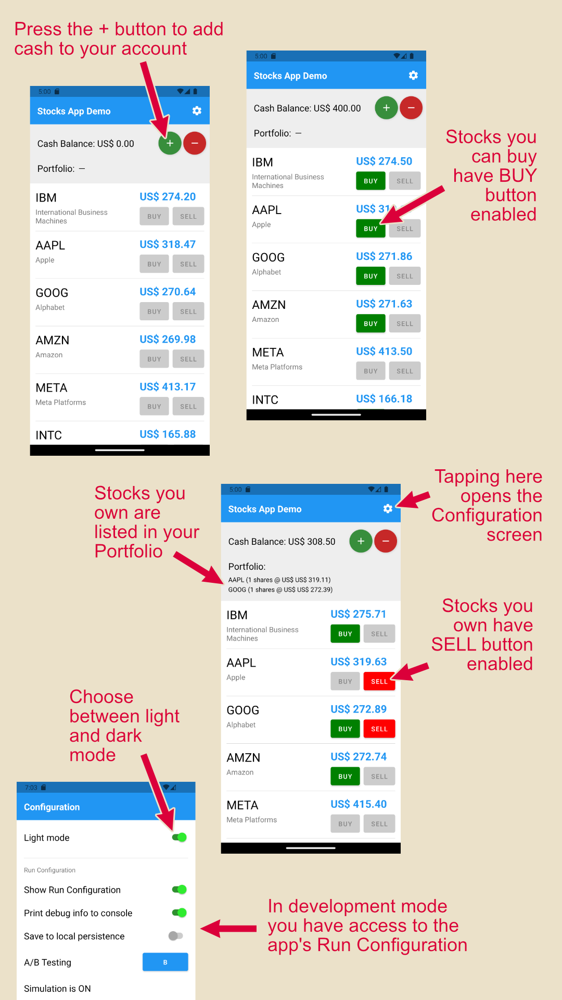
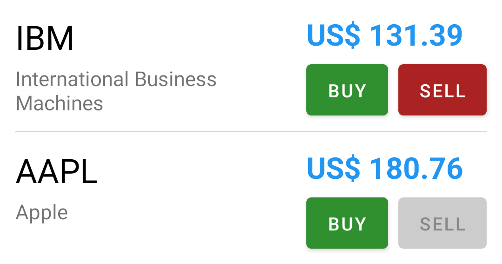

# Flutter with Redux

> This is part of the <a href='https://github.com/marcglasberg/SameAppDifferentTech'>**Same App,
> Different Tech**</a> project.
>
> It contains the same simple but non-trivial **mobile app** implemented using a
> variety of *different tech stacks*.

### Why is this repository useful?

* It helps you learn **Redux state management for Flutter**.


* If you're already familiar with Redux for Flutter, it provides you with a consistent reference
  point for you to <a href='https://github.com/marcglasberg/SameAppDifferentTech'>learn other
  technologies</a> by comparing them through applications that are functionally identical.


* Feel free to clone this repository as a foundation for your own Flutter Redux applications.
  It's a starting point for clean, well organized, well documented code, which is easy to
  understand, develop, refactor, change, maintain and test.

## This app demonstrates the following:

* Flutter app.

* Using Redux (<a href="https://pub.dev/packages/async_redux">Async Redux</a>)
  for state management.

* Easy theming, and changing between light and dark modes,
  using the <a href="https://pub.dev/packages/themed">Themed</a> package.

* Easy Localization (translations),
  using the <a href="https://pub.dev/packages/i18n_extension">i18n_extension</a> package.

* Uncoupling the backend communication by using a DAO (Data Access Object) pattern, featuring:
    * Using a "fake" backend for development and testing
    * Using a "real" backend for production
    * On-demand fetching (REST get), or continuous streaming (websocket)

* Saving data to the local device storage (using Async Redux's `Persistor` and `LocalJsonPersist`
  classes).

* Configuring the app with a "Run Configuration".

* How to test the app.

* Organizing the app directories.

* Note: This example app does not cover Navigation (even though Async Redux does contain navigation
  features) nor Authentication.

This is the app:



# The State

Class `AppState` is the app state, composed of 3 "sub-states":

* `Portfolio` contains the cash balance and the list of stocks owned by the user.
* `AvailableStocks` contains the list of stocks that are available for purchase.
* `Ui` contains state related to the user interface.

It's defined in [app_state.dart](lib/client/infra/app_state.dart):

```dart
class AppState {
  Portfolio portfolio;
  AvailableStocks availableStocks;
  Ui ui;

  static AppState initialState() =>
      AppState(
        portfolio: Portfolio.EMPTY,
        availableStocks: AvailableStocks.EMPTY,
        ui: Ui.DEFAULT,
      );

  ...
}
```

This state is managed by the `Store` class, which is part of the Redux package.

The `Business.init()` method (in [business.dart](lib/client/infra/basic/business.dart))
instantiates the business classes when the app starts. This method:

1. Sets up some app configurations.
2. Creates the "persistor" which loads the state from the local device disk when the app starts,
   and saves the state whenever the state changes, later on.
3. If no state is found in the local device disk, it creates a new state and then saves it.
4. Creates the Redux "store" which holds the app state in memory.
5. Initializes the DAO (Data Access Object) which is responsible for fetching data from the backend.
6. Runs a Redux action called `InitApp_Action` with stuff the Store needs to do as soon as the
   app opens.

```dart
Future<void> init(RunConfig runConfig) async {
  // 1
  RunConfig.setInstance(runConfig);

  // 2
  var persistor = AppPersistor();
  AppState? initialState = await persistor.readState();

  // 3
  if (initialState == null) {
    initialState = AppState.initialState();
    await persistor.saveInitialState(initialState);
  }

  // 4
  store = Store<AppState>(
      initialState: initialState,
      persistor: persistor,
      ...
  );

  await DAO.init(); // 5

  store.dispatch(InitApp_Action()); // 6
}
```

Note: The `persistor` object above implements the `Persistor` interface defined
in the Redux package:

```dart
abstract class Persistor<AppState> {

  Future<AppState?> readState();

  Future<void> deleteState();

  Future<void> persistDifference({AppState? lastPersistedState, AppState newState});
}
```

The `persistor` is passed to the `Store` constructor.
This allows the Redux store to monitor state changes, and call the appropriate `persistor`
methods whenever something needs to be loaded or saved.

Check file [app_persistor.dart](lib/client/infra/persistor/app_persistor.dart) to see how
loading and saving to local device disk is implemented. Note I'm saving to local files,
but a database could be used instead.

## How to access the State

Check file [app_homepage.dart](lib/client/infra/basic/app_homepage.dart),
where I create the top of the widget tree. This includes setting up:

* The `StoreProvider` to provide the `Store` to the rest of the app.
* The app theme (colors and fonts, using the <a href="https://pub.dev/packages/themed">Themed</a>
  package)
* Localization (translations, using the <a href="https://pub.dev/packages/i18n_extension">
  i18n_extension</a> package)
* The lifecycle manager (which listens to app entering background and foreground)
* The app navigation/routes.
* The user exception dialog (to show error messages to the user)
* Analytics (hinted by a comment, but not implemented)

After this is done, the whole app can access the state and dispatch actions by using
the `StoreProvider` or a `StoreConnector`.

Using the `StoreProvider` is more direct, and you can use it from inside any widget in the tree:

```
StoreProvider.of<AppState>(context, this).dispatch(SomeAction_Action());
```

However, the recommended way is using the `StoreConnector`:

```dart
Widget build(BuildContext context) =>
    StoreConnector<AppState, Vm>(
        builder: (context, vm) => ConfigurationScreen(...);
        ...
    );
```

The `StoreConnector` allows you to use the _dumb/smart pattern_, which is more verbose but
more clean-code. It's also easier to test, as it clearly separates the business and the UI layers.
More on that later.

# Initializing the app

In [main.dart](lib/client/infra/basic/main.dart) we create a "run-configuration",
and start the app with it:

```dart
void main() async {
  var runConfig = RunConfig(
    dao: new SimulatedDao(),
    ifShowRunConfigInTheConfigScreen: true,
    abTesting: AbTesting.A,
  );

  startApp(runConfig);
}
```

Then, the `startApp()` function instantiates the
Business layer (like state classes and AsyncRedux/Actions),
and the Client layer (like widgets and screens):

```dart
Future<void> startApp(RunConfig runConfig) async {
  WidgetsFlutterBinding.ensureInitialized();

  await Future.wait([
    Business.init(runConfig),
    Client.init(),
  ]);

  runApp(const AppHomePage());
}
```

# The DAO

The `DAO` (Data Access Object) gets data from the backend.
Here's what it gives us:

* **Ready-to-use data:** The DAO takes care of getting data and turns it into simple objects that
  our app can
  easily use.


* **Hides complex details:** The DAO ensures that our app doesn't have to deal with the details of
  fetching data.
  Whether it's through JSON, gRPC, REST, GraphQL, or other ways, the DAO handles it all. This keeps
  things simple for the rest of the app.


* **Layer of separation:** The DAO separates the data fetching part from the rest of the app.
  This means if the way we get the data changes, the rest of the app stays the same.


* **Easier testing:** Since the DAO only deals with data, it's simpler to test if it works correctly
  without using the entire app. We can mock or simulate the DAO in our tests, allowing us to focus
  on the business logic and UI widgets independently of the data source.


* **Uncoupled development:** By mocking or simulating the DAO,
  we can work on a specific app feature even if its backend isn't ready yet.
  We can also simulate different scenarios, such as network errors, to see how the app behaves.

In the [dao.dart](lib/client/infra/dao/dao.dart) file, we define the `Dao` interface:

```dart
abstract class Dao {

  Future<void> init();

  Future<IList<AvailableStock>> readAvailableStocks();

  Future<void> startListeningToStockPriceUpdates({required PriceUpdate callback});

  Future<void> stopListeningToStockPriceUpdates();
}
```

DAO methods return mostly Futures, because they need to asynchronously fetch data from the backend.

Once we inject the DAO into the run-configuration
(by doing `var runConfig = RunConfig(dao: RealDao())`)
we can access it from anywhere in the app by just importing it:

```
import 'package:mobile_app_flutter_redux/business/infra/dao/dao.dart';

var myStocks = await DAO.readAvailableStocks();
```

In the above code, the DAO returns the available stocks as a list of objects of
type `AvailableStock`, and not as JSON.
You should avoid returning JSON or any other specific transport data format from the DAO.
Always return rich objects that are easy to use by the rest of the app.

This makes it very easy to mock or simulate the DAO,
because creating an object is simpler than composing JSON information.

## Difference between mocking and simulating the DAO

A **mocked DAO** is a fake DAO that returns some **hard-coded** data. This is useful for both
developing and testing the app, as we can mock different scenarios, such as network errors, and see
how the app behaves.

A **simulated DAO** is something different. It is also a fake DAO, but instead of returning
hard-coded data, it returns data that is generated by a **partial simulation of the backend**.

While mocking is much more common than simulation, I personally strongly prefer using a simulated
DAO instead of a mocked one. The reason is that a simulated DAO is much more realistic, and
therefore more useful.

When you instantiate the app with a simulated DAO, you can open the app yourself and interact with
it as if it were connected to a real backend.
This is very useful for developing the app, as we don't have to worry whether the backend is ready
or not.

But it also helps in automatic testing, as we don't need to create mocks for every single
scenario. We can just use the simulated DAO, and it will behave very similarly to the real backend.

When you are ready to switch to the real backend, you can just inject the "real DAO" in the app,
instead of the "simulated DAO". This is very easy to do, as the rest of the app doesn't need to
change at all.

```dart
// Injecting the real DAO:
var runConfig = RunConfig(
    dao: RealDao()
);

// Injecting the simulated DAO:
var runConfig = RunConfig(
    dao: SimulatedDao()
);
```

You might believe that simulating the DAO requires more effort than mocking it, but usually, it
doesn't, because the simulation only needs to be "partial".
While the real backend needs to deal with multi-user concurrency,
the simulated DAO can just return data for a single user.

Similarly, the simulated DAO doesn't need to handle real login processes, talk to other services,
work with databases, or manage actual network errors, and so on.
It can simply return data without worrying about all these issues.
It doesn't need to be perfect, but just good enough to help us develop and test the app.

Please use the app code as given, and try it out a little. It's using a simulated DAO.
In file [simulated_dao.dart](lib/client/infra/dao/simulated_dao/simulated_dao.dart) you can see
how it returns a list of predefined available stocks, and generates random stock price updates every
few milliseconds.

We start by creating a `SimulatedDao` class that extends `Dao`:

```dart
class SimulatedDao extends Dao {
  ...
}
```

As an example, this is how we could implement the `readAvailableStocks()` method to simulate a data
fetch:

```dart
Future<IList<AvailableStock>> readAvailableStocks() async {
  await simulatesWaiting(250);

  return _hardcodedStocks
      .map((stock) => AvailableStock(stock.ticker, name: stock.name, currentPrice: stock.price))
      .toIList();
}

```

Note how the method waits for 250 milliseconds before returning the data.
This is to simulate a network delay.

In this same file, look at the methods `listenToStockPriceUpdates()` and `stopStockPriceUpdates()`
to see how we easily simulate the continuous streaming of stock price updates.

You can also run tests against the simulated DAO.
This speeds up integration tests to be as quick as unit tests,
because DAO calls immediately return predictable data.
With some backend preparation, you can also run the tests against the real backend.
If some tests succeed in the simulation but not with the actual backend,
then it's clear there's an issue with either the backend or the simulation.
It's usually easy to find out which one is the problem.

Please check the tests in the `test` directory.

# The RunConfig

The `RunConfig` class is the "run configuration" which contains the configuration parameters
for the app. It's defined in file [RunConfig.dart](lib/client/infra/run_config/run_config.dart).

You can set up distinct configurations for various environments,
like development, staging, and production.
You can also have different configurations for different developers.
For example, you can have a configuration for John, and another for Mary.
This approach is helpful if John and Mary work on separate features and require different backends
or simulations.

Developer configurations are typically not committed to source control;
they are stored in a separate file that Git ignores.

I like to include a boolean flag in the run configuration to indicate whether users can view
and perhaps manually alter parts of the configuration within the app.
This feature is good for debugging, since it enables me to modify the configuration
without needing to recompile the app.

If you run the app and tap the "Settings" icon button in the top right corner,
you'll be taken to the configuration screen.

The first item in this screen is the 'Light/Dark mode' switch, accessible to all users.
The other items become available only if the `RunConfig.ifShowRunConfigInTheConfigScreen` flag
in the run configuration is set to `true`.

## A/B testing

For example, one of the options here lets the developer choose between `Auto`, `A` or `B`, for an
A/B testing.

`Auto` means that the app will automatically choose between A and B,
based on criteria such as the user's ID or frameworks
like <a href='https://firebase.google.com/docs/ab-testing'>Firebase A/B testing</a>.

The other options, `A` and `B`, are for development or testing.
Tap the blue button on the configuration screen to switch between A and B;
you'll notice the app's behavior change accordingly.
I programmed the stock price's font size and color to be large and blue in A,
and small and black in B.

This is the code:

```
static var priceStyleA = Font.large + AppColor.blue + FontWeight.bold;
static var priceStyleB = Font.medium + AppColor.text + FontWeight.normal;

Widget build(BuildContext context) {
  return ...
     Text(availableStock.currentPriceStr, style: abTesting.choose(priceStyleA, priceStyleB))
```

The `abTesting.choose()` method takes two parameters: `priceStyleA` and `priceStyleB`.
It returns the first parameter if the `RunConfig.abTesting` flag is set to `A`,
and the second parameter if it's set to `B`.

Check file [ab_testing.dart](lib/client/infra/run_config/ab_testing.dart) to see how
this is implemented.

# Theming the app

The main goals of theming the app are:

1. Detect automatically whether the operational system is in light or dark mode, and automatically
   adopt that mode.


2. Allow the user to manually select between light and dark modes.   
   Note while some apps may offer more than these two modes, such instances are rare.


3. Save the user's choice, so that the next time the app is opened, it will start with that.


4. Allow the React widgets to access the colors they need in an easy way.

Please check file [app_themes.dart](lib/client/infra/theme/app_themes.dart)

We first define a `Font` class, with all the fonts defined by the designers in the app's design
system:

```dart
class Font {

  static const small = TextStyleRef(
    TextStyle(
      inherit: false,
      fontSize: 16,
      color: AppColor.text,
      fontWeight: FontWeight.normal,
      textBaseline: TextBaseline.alphabetic,
      fontFeatures: fontFeatures,
      leadingDistribution: TextLeadingDistribution.even,
    ),
  );

  static const medium = TextStyleRef(
    TextStyle(...),
  );
```

Then, we create an `AppColor` class, with all the colors of the **light** theme:

```dart
class AppColor {
  static const text = ColorRef(const Color(0xF0000000), id: 'text');
  static const textDimmed = ColorRef(const Color(0x60000000), id: 'dimmed');
  static const bkg = ColorRef(const Color(0xFFFFFFFF), id: 'bkg');

  ...
}
```

Finally, we create a map with the dark theme:

```dart

Map<ThemeRef, Object> darkTheme = {
  AppColor.text: const Color(0xFFFFFFFF),
  AppColor.textDimmed: const Color(0x60FFFFFF),
  AppColor.bkg: const Color(0xF0000000),
  ...
}
```

In the UI code, we may simply import the `Font` and `AppColor` and use it. For example:

```
import 'package:mobile_app_flutter_redux/client/theme/app_themes.dart';

Text("Done", style: Font.small + AppColor.white),
```

To toggle between light and dark modes, we dispatch the `ToggleLightAndDarkMode_Action`.

Check
file [ACTION_toggle_light_and_dark_mode.dart](lib/client/configuration_screen/ACTION_toggle_light_and_dark_mode.dart)
to see how this is implemented:

```
if (isDarkMode) 
   Themed.currentTheme = darkTheme;
else 
   Themed.clearCurrentTheme();
```

## Spacing

Some design systems also specify spacing between UI elements, in logical pixels.

One way to separate two widgets is to use padding.
However, I think it is easier and more semantic to do it like this:

```
Row(
   children: [
      space8,
      ElevatedButton(child: const Text('Buy')),
      space8,
      ElevatedButton(child: const Text('Sell')),
   ],
);
```

In file [app_themes.dart](lib/client/infra/theme/app_themes.dart) we specify all the spacings we need:

```
const double px8 = 8;
const double px12 = 12; 
...

const Widget space8 = SizedBox(width: px8, height: px8);
const Widget space12 = SizedBox(width: px12, height: px12); 
...
```

# Testing the app

To completely test the app, we need at least:

* Unit tests
* Widget tests
* Integration tests (which I implement as Bdd tests,
  by using <a href="https://pub.dev/packages/bdd_framework">BDD Framework</a>
  (my own library for Behavior-Driven Development)
* Golden tests (which consist of comparing the rendered UI with a reference image)

The tests are inside the `test` directory.

### Unit tests

The simplest tests are the unit tests that exercise:

* The model classes, like [stock_test.dart](test/stock_test.dart)
* The utility classes, like [utils_test.dart](test/utils_test.dart)
* The infrastructure classes in the [infra](lib/client/infra) directory (not provided in this
  example app)

<br>

### Widget tests

Consider the widget which shows one of the available stocks the user can buy.
It displays the stock ticker and name, its current price, and two buttons for buying and selling
the stock. Here are two of them in a column:

<div style="text-align: center;">

</div> 

File [available_stocks_mixed.dart](lib/client/portfolio_and_cash_screen/available_stocks/available_stocks_panel_mixed.dart)
defines the `AvailableStock_Mixed` widget,
which uses `context.state.availableStocks` to access the store directly within the UI code:

```
return SingleChildScrollView(
   child: Center(
     child: Column(      
       children: [        
         for (var availableStock in context.state.availableStocks.list)
            AvailableStockWidget_Connector(availableStock: availableStock),
       ])));
```

I'm calling this a "mixed widget" because it **mixes** accessing the state from inside the UI code.

To test this mixed widget, we need to use "widget tests" to render the widget,
then interact with the UI and check that the rendered widget is as expected.

For example, suppose we want to test that the BUY button is disabled when there is no money
to buy stock.
We can create the initial state with zero money, and then find the BUY button and check that its
color is grey.
Then, we can add some money and check that its color changes to green.

In other words, testing this widget is hard, because it must be tested through UI tests,
which are more complex, slow and brittle.

### The connector/view pattern

The widgets I actually use in the app are composed of a separate "connector" to access the store,
and a "view" that gets all its information from the container.

The combination of **connector** and **view** is called the "connector/view pattern",
or "container/view pattern", or "container/presentational pattern", or "smart/dumb pattern".

While we don't strictly need this pattern to create the widget,
the separation of concerns is still useful, in my opinion, because it makes the code easier to test
and to understand.

1. The Connector

   File [stock_and_buy_sell_buttons.dart](lib/client/portfolio_and_cash_screen/available_stocks/stock_and_buy_sell_buttons.dart)
   contains the connector widget `StockAndBuySellButtons_Connector`, which has no UI.
   Its goal is simply to access the store, use a `Factory` to create a data structure called
   the "view-model" with all the necessary information, and then pass it down to the
   view widget `StockAndBuySellButtons`.

   Here is a simplified version of the connector, the factory and its view-model:

    ```                                      
    class StockAndBuySellButtons_Connector extends StatelessWidget {
      final AvailableStock availableStock;
    
      const StockAndBuySellButtons_Connector({ required this.availableStock });
    
      Widget build(BuildContext context) => StoreConnector<AppState, _Vm>(
          vm: () => Factory(this),
          builder: (context, vm) => StockAndBuySellButtons(
              availableStock: availableStock,
              onBuy: vm.onBuy,
              ifBuyDisabled: vm.ifBuyDisabled);
          }); 
    }
    
    class Factory extends AppVmFactory<_Vm, StockAndBuySellButtons_Connector> {
      Factory(StockAndBuySellButtons_Connector? connector) : super(connector);
    
      _Vm fromStore() => _Vm(
            onBuy: () => dispatch(BuyStock_Action(connector.availableStock, howMany: 1));
            ifBuyDisabled: !state.portfolio.hasMoneyToBuyStock(widget.availableStock));
    }
    
    class _Vm extends Vm {
      final VoidCallback onBuy;
      final bool ifBuyDisabled;    
      _Vm({required this.onBuy, required this.ifSellDisabled}) : super(equals: [ ifBuyDisabled ]);
    }
    ```   

   Testing the **container** is mainly testing that the view-model is correct, for each given state.

   This is shown in
   file [stock_and_buy_sell_buttons_test.dart](test/stock_and_buy_sell_buttons_test.dart)

   For example, here we create the state with an empty Portfolio and $100 of cash balance.
   The available stock to buy is IBM, which costs $150.
   We then check that `ifBuyDisabled` is true, meaning the buy button will be disabled:

   ```dart
   var ibmAvb = AvailableStock('IBM', name: 'I. B. Machines', currentPrice: 150);
   var storeTester = StoreTester(initialState: AppState.from(cashBalance: 100, availableStocks: [ibmAvb]));
   var factory = Factory(StockAndBuySellButtons_Connector(availableStock: ibmAvb));
   var vm = factory().fromStoreTester(storeTester)!;
   expect(vm.ifBuyDisabled, true);
   ```

2. The View

   File [stock_and_buy_sell_buttons.dart](lib/client/portfolio_and_cash_screen/available_stocks/stock_and_buy_sell_buttons.dart)
   also contains `AvailableStockView`, which is the view. It does not access the store directly.
   Instead, it gets all information in its constructor.

   ```
   const StockAndBuySellButtons({      
      required this.availableStock,
      required this.onBuy,
      required this.ifBuyDisabled,
      ...
   });
   ```

   Just like when testing the mixed widget, the only way to test the view is through UI testing
   (widget tests). However, the ability to configure it through its constructor simplifies the
   testing process.

   For example, we don't need to test that the BUY button is disabled when there is no money to buy
   stock. We just need to test that passing `ifBuyDisabled: true` to the constructor will indeed
   disable the button.

   Likewise, we don't need to test that pressing the BUY button will call the correct store
   function. We just need to test that it actually calls the `onBuy()` callback.

## BDD tests

BDD stands for _Behavior-Driven Development_.

It's a way of writing executable tests that are easy to read, even for non-programmers,
and that also serve as documentation.

I won't go into details here, but I'm providing two files with BDD tests, to demonstrate how to
create them:

* [bdd_average_price_test.dart](test/bdd_average_price_test.dart)
* [bdd_buy_and_sell_test.dart](test/bdd_buy_and_sell_test.dart)

These BDD tests use a **<a href="https://pub.dev/packages/bdd_framework">BDD Framework</a>**,
that I have developed myself.

Let's see an example of a BDD test description that specifies the behavior of the app when the user
buys stocks:

```gherkin
Feature: Buying and Selling Stocks

  Scenario: Buying stocks

    Given The user has 120 dollars in cash-balance.
    And IBM price is 30 dollars.
    And The user has no IBM stocks.
    When The user buys 1 IBM.
    Then The user now has 1 IBM.
    And The cash-balance is now 90 dollars.
```

The following is the implementation of the test:

```dart
void main() {
  var feature = BddFeature('Buying and Selling Stocks');

  Bdd(feature)
      .scenario('Buying stocks.')
      .given('The user has 120 dollars in cash-balance.')
      .and('IBM price is 30 dollars.')
      .and('The user has no IBM stocks.')
      .when('The user buys 1 IBM.')
      .then('The user now has 1 IBM.')
      .and('The cash-balance is now 90 dollars.')
      .run((ctx) async {
    // Given:
    var ibm = AvailableStock('IBM', name: 'IBM corp', currentPrice: 30.00);
    var state = AppState.from(cashBalance: 120.00, availableStocks: [ibm]);
    var storeTester = StoreTester(initialState: state);

    // When:
    await storeTester.dispatchAndWait(BuyStock_Action(ibm, howMany: 1));
    storeTester.wait(BuyStock_Action);

    // Then:
    expect(storeTester.lastInfo.state.portfolio.howManyStocks('IBM'), 1);
    expect(storeTester.lastInfo.state.portfolio.cashBalance, CashBalance(90.00));
  });
}
```

Please note, the above BDD test runs against the **simulated backend**.
This means it runs as fast as a unit test.

If you want to run it against the **real backend**,
you can do so by injecting the real DAO instead of the simulated one, like so:

```dart

var runConfig = RunConfig(dao: RealDao(), ...);
```

### Feature files

File [run_all.dart](test/run_all.dart) contains the following code:

```dart
import 'package:bdd_framework/bdd_framework.dart';
import 'package:flutter_test/flutter_test.dart';
import 'bdd_average_price_test.dart' as bdd_average_price;
import 'bdd_buy_and_sell_test.dart' as bdd_buy_and_sell;

void main() async {
  BddReporter.set(FeatureFileReporter(clearAllOutputBeforeRun: true));
  group('bdd_buy_and_sell_test.dart', bdd_buy_and_sell.main);
  group('bdd_average_price_test.dart', bdd_average_price.main);
  await BddReporter.reportAll();
}
```

Running this file, which uses the `FeatureFileReporter`, will run the BDD tests, and automatically
generate `.feature` files from them.

Please see the generated files in the `gen_features` directory:

* `average_price.feature`
* `buying_and_selling_stocks.feature`

These files may be committed to source control,
and can be used as living documentation that evolves as the app evolves.

# App Directories

Here's a typical way to organize directories in a Flutter app:

```
lib/
├── widgets/
├── screens/
├── navigation/
├── assets/
│   ├── images/
│   └── fonts/
├── styles/
├── utils/
├── services/
└── models/ 

```

I don't like this typical structure, because it spreads out related code into different directories.
For example, if I want to see all the code related to the `AvailableStock`, in the above structure,
I may need to look into
the `widgets`, `screens`, `styles`, `services`, and `models` directories.

Instead, I'd suggest another way that keeps related code together.

## By feature

In this approach, we create a directory called `features`, and then a subdirectory for each feature,
and put all the code related to each feature inside it.
This has two important advantages:

* It's easier to find related code, as it's all in the same directory. When a new developer joins
  the team, it's easier for them to find the code they need to work on. It's also easier for them
  to understand the code, as they don't need to jump from directory to directory.


* It's easier to rename or delete a feature, as all the code related to it is in the same directory.
  For example, if you want to rename the `AvailableStock` feature to `StockToBuy`, you can see all
  the code that needs renaming together.

The `infra` directory contains infrastructure code related to the architecture and wiring of the
app.

Finally, a separate `utils` directory is still needed, as it contains code that is not related to
any specific feature, but is used by all features.

```
src/
├── features/
│   ├── cash_balance_and_portfolio/
│   │   ├── cash_balance/
│   │   └── portfolio/
│   ├── profile/
│   ├── signup/
│   ├── login/
│   ├── help_and_support/
│   ├── configuration_screen/
│   └── app_bar/
│
├── infra/
│   ├── auth/    
│   ├── dao/    
│   ├── run_config/
│   ├── theme/
│   └── navigation/
│
└── utils/
```

## By feature with Business/UI separation

In the above approach, the directory of a specific feature will contain both the UI and business
code related to that feature.

For example, the Portfolio code:

```
src/
├── features/
│   ├── portfolio_and_cash_screen/
│   │   ├── portfolio/
│   │   │   ├── ACTION_buy_stock.dart
│   │   │   ├── ACTION_sell_stock.dart
│   │   │   ├── portfolio.dart (Business code)
│   │   │   ├── portfolio_widget.dart (UI code)
│   │   │   └── portfolio_connector.dart (UI code)
```

This makes it very easy to find all the code related to a feature, but it also makes it easier for
developers to couple business and UI code.
For example, creating Flutter widget that contains a function to calculate some business logic.

To solve this, we can separate the business and UI code into different directories:

```
src/
├── business/
│   ├── infra/    
│   │   ├── dao/    
│   │   ├── run_config/
│   ├── utils/
│   └── state/ 
│       ├── portfolio/
│       ├── profile/
│       ├── sign_up/
│       ├── log_in/
│       ├── help_and_support/
│       ├── configuration_screen/
│       └── app_state.dart
│    
└── ui/
    ├── theme/ 
    ├── utils/     
    ├── portfolio_and_cash_screen/
    │   ├── cash_balance/
    │   └── portfolio/
    ├── profile/
    ├── sign_up/
    ├── log_in/
    ├── help_and_support/
    ├── configuration_screen/
    └── app_bar/
```

For example, the Portfolio code would be:

```
src/
├── business/
│   ├── state/ 
│   │   ├── portfolio/
│   │   │   ├── 
│       │   ├── ACTION_sell_stock.dart
│           └── portfolio.dart (Business code)
│
├── ui/
│   ├── portfolio_and_cash_screen/
│   │   ├── portfolio/
    │   │   ├── portfolio_widget.dart (UI code)
        │   └── portfolio_connector.dart (UI code)
```

## By feature with Model/Client separation

If our goal is sharing code between a mobile application and the admin dashboard that the company's
employees can access, we can separate the client code and the business models into different
directories:

For example, the Portfolio code:

```
src/
├── client/
│   ├── infra/
│   │   ├── basic/    
│   │   ├── dao/    
│   │   ├── navigation/    
│   │   ├── persistor/    
│   │   ├── run_config    
│   │   └── theme    
│   │   └── app_state.dart    
│   ├── app_bar/
│   ├── configuration_screen/
│   ├── portfolio_and_cash_screen/
│   ├── profile/
│   ├── sign_up/
│   ├── log_in/
│   └── help_and_support/
│
└── models/
    ├── available_stock.dart
    ├── available_stocks.dart
    ├── buy_or_sell.dart
    ├── cash_balance.dart
    ├── portfolio.dart
    ├── stock.dart
    ├── ui.dart   
    └── utils/   
```

For example, the Portfolio code would be:

```
src/
├── client/
│   ├── portfolio_and_cash_screen/
│   │   └── portfolio/
│   │   │   ├── ACTION_buy_stock.dart
│   │   │   ├── ACTION_sell_stock.dart
│       │   ├── portfolio_widget.dart 
│           └── portfolio_connector.dart
├── models/
│   ├── portfolio/
│   │   └── Portfolio.dart 
```

     
---

# What now?

Visit the home page of the <a href='../README.md'>**Same App, Different Tech**</a> project,
and compare this same mobile app implemented using a variety of **different tech stacks**.

