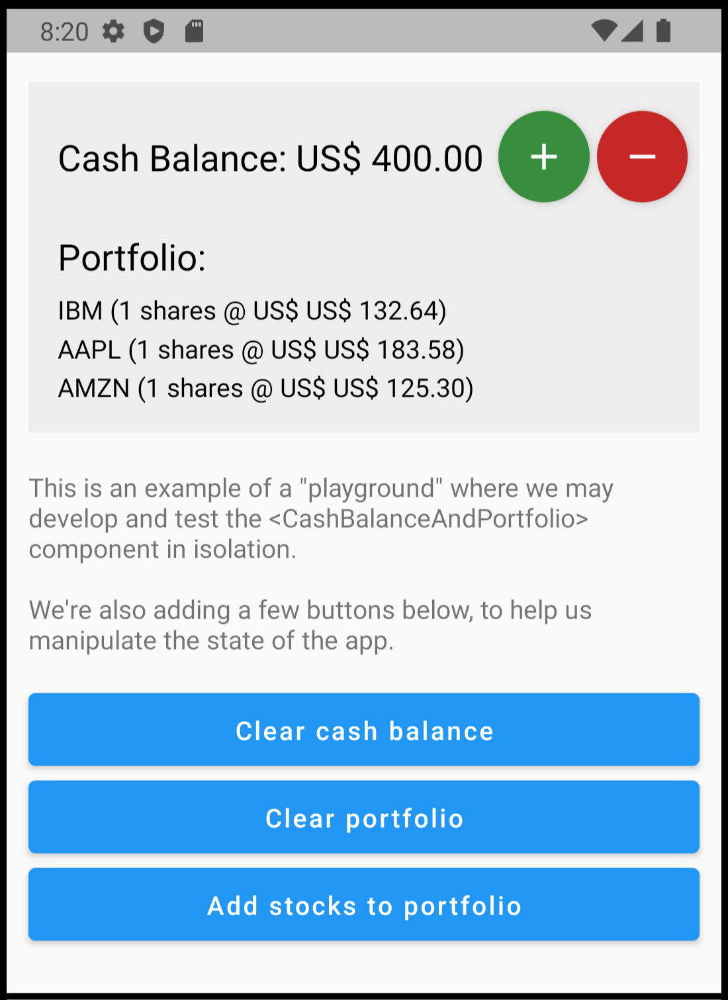
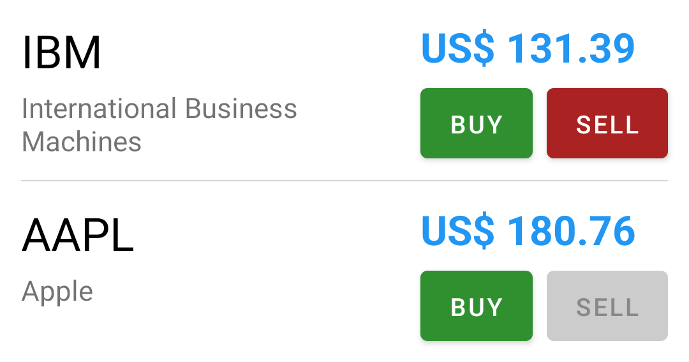

# React Native with MobX

> This is part of the <a href='../README.md'>**Same App, Different Tech**</a>
> project.
>
> It contains the same simple but not trivial **mobile app** implemented using a variety of **different tech stacks**.

### Why is this repository useful?

* It helps you learn **MobX in React Native**. It closely follows the best practices recommended in the MobX
  documentation itself (see here: https://mobx.js.org/defining-data-stores.html), except where noted.


* If you're already familiar with MobX in React Native, it provides you with a consistent reference point
  for you to <a href='../README.md'>learn other technologies</a> by comparing them
  through applications that are functionally identical.


* Feel free to clone this repository as a foundation for your own MobX and React Native applications.
  It's a starting point for clean, well organized, well documented code, which is easy to understand, develop,
  refactor, change, maintain and test.

## This app demonstrates the following:

* React Native app.

* MobX state management (simplest implementation, with no _mobx-state-tree_ nor _mobx-keystone_).

* Easy theming, and changing between light and dark modes.

* Easy approach to styling components.

* Uncoupling the backend communication by using a DAO (Data Access Object) pattern, featuring:
    * Using a "fake" backend for development and testing
    * Using a "real" backend for production
    * On-demand fetching (REST get), or continuous streaming (websocket)

* Saving data to local storage (using AsyncStorage).

* Configuring the app with a "Run Configuration".

* Creating a "playground" to help develop components in isolation.

* How to test the app.

* Organizing the app directories.

* Note: This example app does not cover Navigation, Authentication, or Internationalization aspects.

This is the app:


# Initializing the app

In the [index.js](index.js) file, we inject a few dependencies using the `inject` function.

The inject function can be found in the [inject.tsx](src%2Finject.tsx) file.
This simple function stores the injected dependencies in global variables,
enabling access from anywhere within the app.

```
inject({
  store: new Store(),
  dao: new SimulatedDao(),
  storage: Storage.newInMemoryInstance(),
  runConfig: testConfiguration,
});
```

Let's look at each of these in turn:

* **Store**: Contains all the app state.
* **DAO**: The Data Access Object, which is responsible for fetching data from the backend.
* **Storage**: Responsible for saving data to local storage of the device.
* **RunConfig**: Contains configuration parameters for the app.

# The Store

The `Store` is the main MobX store, and contains all the app state.
It is injected into the app as shown above.
For our example app, the store is structured as follows:

```
export class Store {

  ui: UiStore = new UiStore();
  portfolio: Portfolio = new Portfolio();
  availableStocks: AvailableStocks = new AvailableStocks([]);

  constructor() {
    makeAutoObservable(this);
  }

...
```

Usually, there should be a `UiStore` sub-store to manage state related to the user interface.

The `portfolio` sub-store manages the user's stock portfolio.
It has state such as the cash balance and the list of stocks owned by the user.

The `availableStocks` represents state directly integrated into the main store.
It contains the list of stocks that are available for purchase.

## How to access the Store

After injecting the store as demonstrated, you can access it from any component simply by importing it.
For example:

```
import { store } from '../../inject';
...

<Text style={$title}>
   {`Cash Balance: ${store.portfolio.cashBalance}`}
</Text>
```

In other words, you have the option to use the `store` as a constant global singleton.

Let's discuss this. The MobX documentation states that:

> When using React, this root store is typically inserted into the component tree by using React context.

But this is only necessary if you are doing server-side rendering and need an independent store instance for each
request/user. In case of a client-side app, having a single instance of the store is simpler and works fine.
In this case, the Store is constant, and doesn't change during the lifetime of the app.

**Will global singletons create problems when running tests?**
If we have a static global state, this can indeed create problems when running tests. Since tests might be
dependent on the initial state, one test could inadvertently affect another later test's outcome if it modifies
the global state. The golden rule of testing is that each test should be isolated and independent.
This means that the outcome of each test should not rely on the results of other tests.
Shared global state may violate this principle.
The solution is to make sure that before each test, we'll RECREATE the Store, Dao and Config.
This is easily achievable using Jest's `beforeEach` hook.
Please refer to the tests to see how this is done.

**Will global singletons create problems when running tests IN PARALLEL?** When you're creating tests using Jest, it
provides <a href="https://github.com/jestjs/jest/issues/5623#issuecomment-367123517">complete isolation between
files</a>. It spawns multiple worker processes, which does not pose any additional problems, since each worker process
will have its own instance of the Node.js environment, and won't share state. This parallelization speeds up the overall
test suite, especially if you have a large number of tests.
The tests that run in the same file are run in the same process sequentially, and do not run in parallel by default.
However, you may want to avoid using `test.concurrent()`, as it's
is <a href="https://jestjs.io/docs/api#testconcurrentname-fn-timeout">experimental</a>
and <a href="https://github.com/jestjs/jest/issues/7997">ignores</a> `beforeEach` and `afterEach`.

### Injecting the Store with React Context

If you prefer not to use the store as a global singleton,
you can insert it into the component tree by using a React **context**.

This approach is useful when you need to have multiple instances of the store,
or for applications with server-side rendering (SSR), where you usually make a new store for each request.
Here's how you can do this.

First, create a context for the store:

```
import React from 'react';
import { Store } from './store';

export const StoreContext = React.createContext<Store>(null!);
```

Then, provide the store to the component tree:

```tsx
import React from 'react';
import { Store } from './store';
import { StoreContext } from './StoreContext';

const store = new Store();

function App() {
  return (
    <StoreContext.Provider value={store}>
      { /* rest of your app */}
    </StoreContext.Provider>
  );
}

export default App;
```

Now, use the `useContext` hook in your components to access the store:

```
import { useContext } from 'react';
import { StoreContext } from './StoreContext';

function MyComponent() {
  const store = useContext(StoreContext);
  // Use the store.
}
```

### Using the Store in tests

The following code shows how to create and use the global `store` **in tests**:

```
beforeEach(async () => {
  inject({});
});

test('The cash balance starts as zero, and can be added.', (): void => {
  expect(store.portfolio.cashBalance.amount).toBe(0);
  store.portfolio.cashBalance.add(100);
  expect(store.portfolio.cashBalance.amount).toBe(100);
});
```

When you use `inject({})` as shown above, it creates a new store (please check the [inject.tsx](src%2Finject.tsx) file).
This is the same as doing: `inject({ store: new Store() })`.

If every test in a file needs the store to begin with a certain initial state,
you can create a store in `beforeEach` and change it. For example:

``` 
beforeEach(async () => {
  let store = new Store();
  store.portfolio.cashBalance.setAmount(1000);
  inject({ store: store });
});
```

# The DAO

The `DAO` (Data Access Object) gets data from the backend.
Here's what it gives us:

* **Ready-to-use data:** The DAO takes care of getting data and turns it into simple objects that our app can
  easily use.


* **Hides complex details:** The DAO ensures that our app doesn't have to deal with the details of fetching data.
  Whether it's through JSON, gRPC, REST, GraphQL, or other ways, the DAO handles it all. This keeps things
  simple for the rest of the app.


* **Layer of separation:** The DAO separates the data fetching part from the rest of the app.
  This means if the way we get the data changes, the rest of the app stays the same.


* **Easier testing:** Since the DAO only deals with data, it's simpler to test if it works correctly without using
  the entire app. We can mock or simulate the DAO in our tests, allowing us to focus on the business
  logic and UI components independently of the data source.


* **Uncoupled development:** By mocking or simulating the DAO,
  we can work on a specific app feature even if its backend isn't ready yet.
  We can also simulate different scenarios, such as network errors, to see how the app behaves.

In the [Dao.ts](src%2Fbusiness%2Fdao%2FDao.ts) file, we define the `Dao` as an abstract class or interface:

```
export abstract class Dao {
  abstract readAvailableStocks(): Promise<AvailableStock[]>;
  abstract listenToStockPriceUpdates(onUpdate: (ticker: string, price: number) => void): void;
  abstract stopStockPriceUpdates(): void;
  ...
}
```

DAO methods are mostly Promises, because they need to asynchronously fetch data from the backend.

Once we inject the DAO into the app by doing `inject({ dao: ... })`, we can access it from anywhere in the app
by just importing it:

```
import { dao } from '../../inject';

let portfolio: Portfolio = await dao.loadPortfolio();
```

In this code, the DAO returns the portfolio as an object of type `Portfolio`, and not as JSON.
You should avoid returning JSON or any other specific transport data format from the DAO.
Always return rich objects that are easy to use by the rest of the app.

This makes it very easy to mock or simulate the DAO,
because creating an object is simpler than composing JSON information.

> Note: If your application uses server-side rendering (SSR) you will need another way to inject the DAO, so that
> you can have different DAOs for different users. While there are many ways to do that, I'd suggest putting the
> dao object inside the MobX Store. Your code would then become:
> `let portfolio = await store.dao.loadPortfolio();`.

## Difference between mocking and simulating the DAO

A **mocked DAO** is a fake DAO that returns some **hard-coded** data. This is useful for both developing and testing the
app, as we can mock different scenarios, such as network errors, and see how the app behaves.

A **simulated DAO** is something different. It is also a fake DAO, but instead of returning hard-coded data, it returns
data that is generated by a **partial simulation of the backend**.

While mocking is much more common than simulation, I personally strongly prefer using a simulated DAO instead of a
mocked one. The reason is that a simulated DAO is much more realistic, and therefore more useful.

When you instantiate the app with a simulated DAO,
you can open the app yourself and interact with it as if it were connected to a real backend.
This is very useful for developing the app, as we don't have to worry whether the backend is ready or not.

But it also helps in automatic testing, as we don't need to create mocks for every single
scenario. We can just use the simulated DAO, and it will behave very similarly to the real backend.

When you are ready to switch to the real backend, you can just inject the "real DAO" in the app, instead of
the "simulated DAO". This is very easy to do, as the rest of the app doesn't need to change at all.

```
// Injecting the real DAO:
inject({
   dao: new RealDao(),
});

// Injecting the simulated DAO:
inject({
   dao: new SimulatedDao(),
});
```

You might believe that simulating the DAO requires more effort than mocking it, but usually, it doesn't,
because the simulation only needs to be "partial".
While the real backend needs to deal with multi-user concurrency,
the simulated DAO can just return data for a single user.

Similarly, the simulated DAO doesn't need to handle real login processes, talk to other services,
work with databases, or manage actual network errors, and so on.
It can simply return data without worrying about all these issues.
It doesn't need to be perfect, but just good enough to help us develop and test the app.

Please use the app code as given, and try it out a little. It's using a simulated DAO.
In file [SimulatedDao.ts](src%2Fbusiness%2Fdao%2FSimulatedDao.ts) you can see how it returns a list of available stocks,
and generates random stock price updates every few milliseconds.

We start by creating a `SimulatedDao` class that extends `Dao`:

```
export class SimulatedDao extends Dao {
...
}
```

As an example, this is how we could implement the `readAvailableStocks()` method to simulate a data fetch:

```
private stocks: _Stock[] = [
  { ticker: 'IBM', name: 'International Business Machines', price: 132.64 },
  { ticker: 'AAPL', name: 'Apple', price: 183.58 },        
];

async readAvailableStocks(): Promise<AvailableStock[]> {  
  await new Promise(resolve => setTimeout(resolve, 500)); // Delay
  
  return this.stocks.map(stock => new AvailableStock(stock.ticker, stock.name, stock.price));
}
```

Note how the method waits for 500 milliseconds before returning the data. This is to simulate a network delay.

In the same [SimulatedDao.ts](src%2Fbusiness%2Fdao%2FSimulatedDao.ts) file, look at the
methods `listenToStockPriceUpdates()` and `stopStockPriceUpdates()` to
see how we easily simulate the continuous streaming of stock price updates.

You can also run tests against the simulated DAO.
This speeds up integration tests to be as quick as unit tests,
because DAO calls immediately return predictable data.
With some backend preparation, you can also run the tests against the real backend.
If some tests succeed in the simulation but not with the actual backend,
then it's clear there's an issue with either the backend or the simulation.
It's usually easy to find out which one is the problem.

Please check the tests in the `__tests__` directory.

# The RunConfig

The `RunConfig` class is the "run configuration" which contains the configuration parameters for the app.
It's defined in file [RunConfig.ts](src%2Fbusiness%2FRunConfig%2FRunConfig.ts).

You can set up distinct configurations for various environments, like development, staging, and production.
You can also have different configurations for different developers. For example, you can have a configuration for John,
and another for Mary.
This approach is helpful if John and Mary work on separate features and require different backends or simulations.

Developer configurations are typically not committed to source control;
they are stored in a separate file that Git ignores.

I like to include a boolean flag in the run configuration to indicate whether users can view
and perhaps manually alter parts of the configuration within the app.
This feature is good for debugging, since it enables me to modify the configuration
without needing to recompile the app.

If you run the app and tap the "Settings" button in the top right corner, you'll see the configuration screen.

The list's first item is the 'Light/Dark mode' switch, accessible to all users.
The other items become available only if the `RunConfig.ifShowRunConfigInTheConfigScreen` flag
in the run configuration is set to `true`.

## A/B testing

For example, one of the options here lets the developer choose between `Auto`, `A` or `B`, for an A/B testing.

`Auto` means that the app will automatically choose between A and B,
based on criteria such as the user's ID or frameworks
like <a href='https://firebase.google.com/docs/ab-testing'>Firebase A/B testing</a>.

The other options, `A` and `B`, are for development or testing.
Tap the blue button on the configuration screen to switch between A and B;
you'll notice the app's behavior change accordingly.
I programmed the stock price's font size and color to be large and blue in A, and small and black in B.
This is the code:

```tsx
<Text style={runConfig.abTesting.choose($priceA, $priceB)}>
  {availableStock.currentPriceStr}
</Text>;

const $priceA: TextStyle = { fontSize: 23, color: Color.blueText, fontWeight: 'bold' };
const $priceB: TextStyle = { fontSize: 16, color: Color.text, fontWeight: 'normal' };
```

As MobX observes the `RunConfig`, its `choose` method is re-evaluated whenever the `abTesting` flag changes.
This method takes two parameters: `$priceA` (price style for A) and `$priceB` (price style for B).
It returns the first parameter if the `RunConfig.abTesting` flag is set to `A`, and the second parameter if it's set
to `B`.

Check file [ABTesting.ts](src%2Fbusiness%2FRunConfig%2FABTesting.ts) to see how this is implemented.

## Playground

Another feature I like to add to the run configuration is the `playground`.
It lets you choose a specific component to display instead of the entire app.
You can use it to develop and test that component in isolation.

For instance, `anotherConfiguration` is defined in the [inject.tsx](src%2Finject.tsx) file like this:

```tsx
import { Playground } from './ui/cashBalanceAndPortfolio/Playground';

export const anotherConfiguration = new RunConfig({
  playground: <Playground />,
  ifShowRunConfigInTheConfigScreen: false,
  ifPrintsDebugInfoToConsole: false,
  abTesting: AbTesting.A,
});
```

Next, open the `index.js` file and change it to `runConfig: anotherConfiguration`:

```
inject({
  store: new Store(),
  dao: new SimulatedDao(),
  storage: new Storage(),
  runConfig: anotherConfiguration,
  // runConfig: developmentConfiguration,
});                        
```                        

After hot reloading, you'll notice the app shows the `Playground` component
(see [Playground.tsx](src%2Fui%2FcashBalanceAndPortfolio%2FPlayground.tsx)) instead of the usual app.

<div style="text-align: center;">

</div>

# Saving information locally

The app can save information in the local device, by using the `Storage` and the `StorageManager` classes.

## The Storage class

The `Storage` class abstracts the low level mechanism that saves, loads,
and deletes data in the device's local storage (or in a fake in-memory storage)
by using `setItem`, `getItem`, and `removeItem`, respectively.
The app injects the storage as follows:

```
// Injecting the local disk storage:
inject({
   storage: new Storage(),
});

// Injecting the in-memory storage:
inject({
   storage: Storage.newInMemoryInstance(),
});
```

You can then access the storage from anywhere in the app by just importing it and calling its methods.
For example:

```
import { storage } from '../../inject';

const serializedPortfolio = JSON.stringify(portfolio);
storage.setItem('portfolio', serializedPortfolio);
```

Please check the [Storage.ts](src%2Fbusiness%2Fdao%2FStorage.ts) file.
When using the **disk** storage, it acts as a simple wrapper around the `AsyncStorage` API.
When using the **in-memory** storage, it wraps an in-memory map.

When you run the app as provided, the data is being saved to the device's local disk:
If you buy some stocks, they will still be there when you kill the app and restart it.

If you change the app to use the in-memory storage, then the data will be lost when you kill the app.

When running tests, however, we always use the in-memory storage, so that each test starts with a clean slate.
That's why the default for the `inject` function is to use the in-memory storage:

```
beforeEach(async () => {
  inject({});
});
```

## The StorageManager class

The `StorageManager` class is the high-level code that actually loads the state when the app opens,
and then continuously keeps track and saves the ongoing state changes.
It uses the `storage` object to actually perform the load/save/delete operations,
which might have been configured, as explained above, \
to save to disk (in production) or to memory (in development and tests).

Depending on the app, your storage needs will be different. For example:

* Some apps get all their information from the internet each time they're opened or when needed. They don't store data
  on your device.

* Apps with a small amount of data save everything whenever any data changes. These apps usually load all their data
  when you start them.

* Apps with a lot of data may only save the parts that change. They might load all their data at once when opened, or
  bit by bit as needed.

* If an app has corrupted or deprecated data, it may fix this by deleting all its stored data
  and getting fresh data from the internet.

* Other apps try to correct any corrupted data, apply some migration logic to deprecated data, and then save it again.

* Some apps automatically save data every time there's a change, but others only save when the app is closing, either by
  you or by the system.

* Other apps may need to save some information locally, but don't need to continuously keep track of changes.

The specific scenario which I have implemented in the [StorageManager.ts](src%2Fbusiness%2Fdao%2FStorageManager.ts)
file is this:

1. The `StorageManager` loads all the state from disk as soon as the app opens.
   This is the only time when information is loaded.

   ```
   static async init() {
      ...
      await StorageManager.loadPortfolio();
   ```

2. It then sets up a 2-second interval to periodically check if the state has been modified,
   and ensures that only one instance of this interval is active at any time.
   Only if a change is detected, it triggers a save operation.

   The reason why we do it in an interval, instead of saving the state as soon as it changes,
   is that we want to avoid too many saves making the app slow. We therefore "aggregate" all state changes
   that happened in the last 2 seconds, and save them all at once.

   ```
   if (StorageManager.intervalId !== null) ... { 
      return; 
   }   
   
   StorageManager.intervalId = setInterval(async () => {
      ...
      await StorageManager.savePortfolio();
      ...      
    }, 2000); // 2 seconds interval.
   ```

3. It uses a flag named `isBusy` to avoid concurrent load and save operations and to prevent overlapping save
   operations during subsequent interval triggers.

   ```
   if (StorageManager.isBusy) ... {      
      return;
    }

    StorageManager.isBusy = true;
    try {
      await StorageManager.loadPortfolio();
    } ...
    } finally {
      StorageManager.isBusy = false;
    }
   ```

4. The `StoreManager` detects changes in state through the MobX store. Whenever there's a change, the function
   `StorageManager.markPortfolioChanged()` is called. This function sets a boolean flag to `true`,
   indicating that the state needs to be saved.

   ```  
   class Portfolio {
   ... 
      
   reaction(
      () => [ this.stocks.map(stock => stock), this.cashBalance, this.cashBalance.amount],
      () => StorageManager.markPortfolioChanged(),
      ... 
   ``` 

5. In [App.tsx](src%2FApp.tsx) there is a mechanism implemented with the `handleAppShutdown()` function,
   where a save is triggered immediately when the app is shutting down, ignoring the 2-second interval.
   This is important to make sure no state is lost.

# Theming the app

The main goals of theming the app are:

1. Detect automatically whether the operational system is in light or dark mode, and automatically adopt that mode.


2. Allow the user to manually select between light and dark modes.   
   Note while some apps may offer more than these two modes, such instances are rare.


3. Save the user's choice, so that the next time the app is opened, it will start with that.


4. Allow the React components to access the colors they need in an easy way.

I like this article about React Native theming, and suggest you follow it:
<a href="https://medium.com/simform-engineering/manage-dark-mode-in-react-native-application-2a04ba7e76d0">
_2 Easy Ways to Add Dark Mode in a React Native Application_</a>.

By following the article, you'll end up having to add this line to all components that need to access the colors:

```
const colors = useTheme().colors;
```                                            

While this approach is acceptable, given our use of MobX, we will adopt a different strategy to observe theme changes.

Please check file [Color.ts](src%2Fui%2Ftheme%2FColor.ts).
We first define a palette, containing all the colors defined by the designers in the app's design system:

```
const palette = {
  white: '#fff',
  black: '#000',
  background: '#fff',
  backgroundSemiTransparent: 'rgba(255, 255, 255, 0.55)',
  ...
```

Then, we create a `Theme` type where we name all the colors that we use in the app:

```
type Theme = {
  text: string;
  invertedText: string;
  error: string;
  divider: string;
  ...
```

Then, we create light and dark themes:

```
const lightTheme: Theme = {
  text: palette.foreground,
  invertedText: palette.background,
  error: palette.red,
  ...
} as const;

const darkTheme: Theme = {
  text: palette.background,
  invertedText: palette.foreground,
  error: palette.red,
  ...
} as const;
```

Finally, `Color` is observed by MobX and gives us access to the colors,
and to methods to change the theme.

In the UI code, we may simply import the `Color` and use it. For example:

```
import Color from '../theme/Color';
...

const AppBar ... = observer(({ title, actionButton }) => {
  
  const $safeArea: ViewStyle = { backgroundColor: Color.appBar, ... };
  const $row: ViewStyle = { backgroundColor: Color.appBar, ... };
  const $title: TextStyle = {color: Color.palette.white, ... };

  return (
    <SafeAreaView style={$safeArea}>
    <Row style={$row}>
    <Text style={$title}>{title}</Text>
    ...
```

In the business code, we may simply call `Color.setLightTheme()` and `.setDarkTheme()`, as needed:

```
public toggleLightAndDarkMode() {
   this.isLightMode = !this.isLightMode;
   
   if (this.isLightMode) Color.setLightTheme();
   else Color.setDarkTheme();
}
```

## Styles

As the styles need to use `Color`, they should be created inside an observed component, so that they may rebuild when
the theme changes.

I like to define the styles in the components themselves, and not in a separate file, and name them
with a `$` prefix. This makes it easy to find them in the code, and avoids name conflicts.
It also makes it easy for one style to use another, so that you can build your styles in a modular way.
For example:

```
const MyComponent = observer(() => {  

   const $button: ViewStyle = { fontSize: 20, padding: 16, justifyContent: 'center' };
   const $upButton: ViewStyle = { ...$button, backgroundColor: Colors.up };
   const $downButton: ViewStyle = { ...$button, backgroundColor: Colors.down };
   ...
```

Note: If instead of doing what I described above you prefer using `StyleSheet.create()`, you will still need to
generate it inside the observed component:

```
const MyComponent = observer(() => {
   const styles = getStyles();
   return ...
);

const getStyles = () => StyleSheet.create({
  button: {
  ...  
```

## Fonts

In file [Font.ts](src%2Fui%2Ftheme%2FFont.ts) we define the fonts that we use in the app, taken from the design system:

* Small: 16px font
* Medium: 20px font
* Bold: 20px font, bold
* Big: 23px font, bold
* Large: 26px

We can then use it in our components. For example:

```
const $ticker = Font.large();
<Text style={$ticker}>{availableStock.ticker}</Text>
```

Or inline:

```
<Text style={Font.large()}>{availableStock.ticker}</Text>
```

The default font color is `Color.text`.
If the color we want is different, we can pass it to the method. For example:

```
Font.large(Color.textDimmed);
```

## Spacing

Some design systems also specify spacing between UI elements, in logical pixels.

One way to separate two components is to use padding. For example:

```
<Text style={{ paddingBottom: 12 }}>Apples</Text>
<Text>Oranges</Text>
```

And even define a `Spacing` class to help us stick to the valid values:

```
<Text style={{ paddingBottom: Spacing.px12 }}>Apples</Text>
<Text>Oranges</Text>
```

However, I think it is easier and more semantic to do it like this:

```
<Text>Apples</Text>
<Space.px12 />
<Text>Oranges</Text>
```

In file [Space.tsx](src%2Fui%2Ftheme%2FSpace.tsx) we specify:

* `<Space.px4 />` for 4px of spacing
* `<Space.px8 />` for 8px of spacing
* `<Space.px12 />` for 12px of spacing
* `<Space.px16 />` for 16px of spacing
* `<Space.px20 />` for 20px of spacing

Having `<Space>` components also makes it easier to change the order of elements in the layout.
For example:

```
// Wrong: We need to to move the style between the components.
<Text>Oranges</Text>
<Text style={{ paddingBottom: Spacing.px12 }}>Apples</Text>

// Right: just changed the order.
<Text>Oranges</Text>
<Space.px12 />
<Text>Apples</Text>
```

## Simple layout components

In file [Layout.tsx](src%2Fui%2Futils%2FLayout.tsx) I define a few simple components that substitute some of the uses
of `<View>`:

* `<Row>` instead of `<View style={{ flexDirection: 'row'}>`
* `<Column>` instead of `<View style={{ flexDirection: 'column'}>`
* `<Spacer>` instead of `<View style={{ flex: flex}}>` when used for adjustable empty space

Then, instead of this:

```
<View>
   <Text>Some options</Text>
   <View style={{ flexDirection: 'row', backgroundColor: Color.background, flex: 1 }}>
      <Option1 />
      <Option2 />
   </View>
   <View style={{ flex: 1 }} />
   <Text>Footer</Text>
</View>
```

We can write a more semantic code, which I believe is easier to read:

```
<Column>
   <Text>Some options</Text>
   <Row style={{ backgroundColor: Color.background, flex: 1 }}>
      <Option1 />
      <Option2 />
   </Row>
   <Spacer />
   <Text>Footer</Text>
</Column>
```

# Testing the app

To test the app I use:

* Jest
* BDD Framework (my own library for Behavior-Driven Development)
* React Native Testing Library (RNTL)

The tests are inside the `__tests__` directory.

Note, in many of those tests I inject the appropriate infrastructure objects by calling `inject` with an empty object
inside `beforeEach`:

```
beforeEach(() => {
   inject({});   
});
```

This injects:

* A store with default state
* A simulated DAO
* An in-memory storage
* A run-configuration appropriate for tests

I won't explain these here, since I have already done so above. Please refer
to [Using the Store in tests](#using-the-store-in-tests), [The DAO](#the-dao), [The RunConfig](#the-runconfig),
and [The Storage class](#the-storage-class).

<br>

### Testing business and utility classes

The simplest tests are the unit tests that exercise the business classes and utility classes. For
example, [Stock.test.tsx](__tests__%2FStock.test.tsx) and [utils.test.ts](__tests__%2Futils.test.ts).

<br>

### Testing the store

Then, I test the sub-stores that are part of the main store,
in [UiStore.test.ts](__tests__%2FUiStore.test.ts),
[Portfolio.test.tsx](__tests__%2FPortfolio.test.tsx)
and [AvailableStock.test.tsx](__tests__%2FAvailableStock.test.tsx):

```
export class Store {
   ui: UiStore = new UiStore();
   portfolio: Portfolio = new Portfolio();
   availableStocks: AvailableStocks = new AvailableStocks([]);
```

<br>

### Testing the app infrastructure

Then I test the infrastructure classes, in [RunConfig.test.tsx](__tests__%2FRunConfig.test.tsx),
[Storage.test.tsx](__tests__%2FStorage.test.tsx),
[StorageManager.test.tsx](__tests__%2FStorageManager.test.tsx)
and [Dao.test.tsx](__tests__%2FDao.test.tsx).


<br>

### Testing components

Please check the `src\ui\cashBalanceAndPortfolio\alternative_implementations\` directory.

This folder contains a `mixed` directory containing "mixed" components which are **not used** in the app:

* [AvailableStock.mixed.tsx](src%2Fui%2FcashBalanceAndPortfolio%2Falternative_implementations%2Fmixed%2FAvailableStock.mixed.tsx)
* [AvailableStocksList.mixed.tsx](src%2Fui%2FcashBalanceAndPortfolio%2Falternative_implementations%2Fmixed%2FAvailableStocksList.mixed.tsx)
* [CashBalance.mixed.tsx](src%2Fui%2FcashBalanceAndPortfolio%2Falternative_implementations%2Fmixed%2FCashBalance.mixed.tsx)
* [Portfolio.mixed.tsx](src%2Fui%2FcashBalanceAndPortfolio%2Falternative_implementations%2Fmixed%2FPortfolio.mixed.tsx)

They are provided here as examples,
for comparison with the "container/view" components we actually use in the app.

These mixed components access the MobX store directly from inside the UI code.
They **mix** accessing the state from inside the UI code.

For example, consider the component called `AvailableStock` which displays one of the
available stocks the user can buy.
It displays the stock ticker and name, its current price, and two buttons for buying and selling the stock.
Here are two of them in a column:

<div style="text-align: center;">

</div>     

File [AvailableStock.mixed.tsx](src%2Fui%2FcashBalanceAndPortfolio%2Falternative_implementations%2Fmixed%2FAvailableStock.mixed.tsx)
defines the `AvailableStock_Mixed` component,
which accesses the store directly within the UI code, for example, here:

```
<MaterialButton label="BUY"
   backgroundColor={Color.up}
   disabled={!store.portfolio.hasMoneyToBuyStock(availableStock)} // Here!
   onPress={() => {
      animateAddition(); 
      store.portfolio.buy(availableStock, 1); // Here!
      }} 
/>
```

To test this mixed component, we need to use the React Native Testing Library (RNTL),
render the component, then interact with the UI, and check that the rendered component is as expected.

For example, suppose we want to test that the BUY button is disabled when there is no money to buy stock.
We can create the initial state with zero money, and then find the BUY button and check that its color is grey.
Then, we can add some money and check that its color changes to green.

In other words, testing this component is hard, because it must be tested through UI tests,
which are more complex, slow and brittle.

### The container/view pattern

The components I actually use in the app are composed of a separate "container" to access the store,
and a "view" that gets all its information from the container.

The combination of **container** and **view** is called the "container/view pattern",
or "container/presentational pattern", or "smart/dumb pattern".

The MobX documentation explicitly says you
<a href="https://mobx.js.org/the-gist-of-mobx.html#33-reactive-react-components">don't need to use</a> the
container/view pattern:

> When using MobX there are no smart or dumb components. All components
> render smartly, but are defined in a dumb manner. MobX will simply make
> sure the components are always re-rendered whenever needed, and never more than that.

While it's true that MobX doesn't need this pattern to know when to rebuild/redraw the component,
the separation of concerns is still useful, in my opinion, because it makes the code easier to test and to understand.

1. The Container

   File [AvailableStock.container.tsx](src%2Fui%2FcashBalanceAndPortfolio%2FAvailableStock.container.tsx)
   contains `AvailableStockContainer`, which has no UI.
   Its goal is simply to access the store, create a data structure called the "view-model" with all the necessary
   information, and pass it down to the "view component".

   ```                                  
   // The container component.
   export const AvailableStockContainer: React.FC<{ availableStock: AvailableStock }> 
         = observer(({ availableStock }) => {
   
     // Call the function to create the view-model, 
     // and pass it to the view component.
     return <AvailableStockView {...viewModel(availableStock)} />;
   });

   // Function to create the view-model.   
   export function viewModel(availableStock: AvailableStock) {
     return {
       availableStock,
       ifBuyDisabled: !store.portfolio.hasMoneyToBuyStock(availableStock),
       ifSellDisabled: !store.portfolio.hasStock(availableStock),
       abTesting: runConfig.abTesting,
       onBuy: () => store.portfolio.buy(availableStock, 1),
       onSell: () => store.portfolio.sell(availableStock, 1),
     };
   }
   ```   

   Let's see how to test the **container** in
   file [AvailableStocks.container.test.ts](__tests__%2FAvailableStocks.container.test.ts).

   Testing the container is basically testing that the view-model is correct. This is easy to do, as we can
   simply call the `viewModel()` function with different states, and check that the view-model properties
   are as expected.

   First, we import the view-model from:

   ```
   import { viewModel } from '.../AvailableStock.container';
   ```

   We then set the store state, create the view-model by calling the `viewModel()` function,
   and check that the view-model properties are as expected. Example:

   ```typescript
   // The BUY button is disabled, since we cannot buy stock when there is no money.
   store.portfolio.cashBalance.setAmount(0);
   let vm = viewModel(ibm);
   expect(vm.ifBuyDisabled).toBe(true);
   ```

   We can also call the callbacks defined in the view-model,
   and check that they do what they are supposed to do. Example:

   ```typescript
   // Cash balance is 1000. There are no IBM stocks.
   expect(store.portfolio.howManyStocks(ibm.ticker)).toBe(0);
   store.portfolio.cashBalance.setAmount(1000);
   
   const vm = viewModel(ibm);
   vm.onBuy(); // Buy 1 share of IBM stock.
   
   // Cash balance decreased by the price of 1 IBM stock. Portfolio now contains 1 IBM stock.
   expect(store.portfolio.cashBalance.amount).toBe(1000 - ibm.currentPrice);
   expect(store.portfolio.howManyStocks(ibm.ticker)).toBe(1);
   ```


2. The View

   File [AvailableStock.view.tsx](src%2Fui%2FcashBalanceAndPortfolio%2FAvailableStock.view.tsx)
   contains `AvailableStockView`, which does not access the store directly.
   Instead, it gets all information in its constructor.

   ```
   export const AvailableStockView: React.FC<{
     availableStock: AvailableStock;
     ifBuyDisabled: boolean;
     ifSellDisabled: boolean;
     abTesting: AbTesting,
     onBuy: () => void;
     onSell: () => void;
   }>
     = ({
          availableStock,
          ifBuyDisabled,
          ifSellDisabled,
          abTesting,
          onBuy,
          onSell,
        }) => {
   
   return <...>
   ```

   Just like when testing the mixed component, the only way to test the view is through UI testing,
   using the React Native Testing Library.   
   However, the ability to configure it through its constructor simplifies the testing process.

   For example, we don't need to test that the BUY button is disabled when there is no money to buy stock.
   We just need to test that passing `ifBuyDisabled: true` to the constructor will indeed disable the button.

   Likewise, we don't need to test that pressing the BUY button will call the correct store function.
   We just need to test that it actually calls the `onBuy()` callback.

### Using hooks

Please check the `src\ui\cashBalanceAndPortfolio\alternative_implementations\` directory again.
This folder contains a `hooks` directory containing
file [AvailableStock.hook.tsx](src%2Fui%2FcashBalanceAndPortfolio%2Falternative_implementations%2Fhooks%2FAvailableStock.hook.tsx)
which is **not used** in the app.

Compare it with files [AvailableStock.container.tsx](src%2Fui%2FcashBalanceAndPortfolio%2FAvailableStock.container.tsx)
and [AvailableStock.view.tsx](src%2Fui%2FcashBalanceAndPortfolio%2FAvailableStock.view.tsx).

Instead of defining a container component which returns a view component,
the "hooks implementation" is a single component that gets its information from a hook. In this case:

* Instead of a container component, we have a hook.

* Instead of a view component that gets information from its constructor,
  we have a component that gets its information from the hook.

Some people say that hooks are better than the container/view pattern, because they are simpler and more
straightforward. I personally think that by using hooks like this, you are still using the container/view pattern.
As long as you first get your information from the store, and then pass it down to a component that consumes
this information, that's what defines the pattern for me.

One other difference when using hooks, is that some people like to have more than one hook in the component.
For example, you may have one hook to read information from the store, another to serve as a "controller" for the UI,
etc. I personally prefer to have a single hook, which gets all the information from the store, and then pass it down
to the component, as seen in
file [AvailableStock.hook.tsx](src%2Fui%2FcashBalanceAndPortfolio%2Falternative_implementations%2Fhooks%2FAvailableStock.hook.tsx).

Note that testing the hook itself is exactly the same as testing the previous `viewModel` function,
as they are identical.
However, my personal opinion is that having the original "container/view" components is a bit easier than using hooks,
because to test the view component with hooks you have to mock the hook,
while before you only needed to send the correct parameters to the constructor.

## BDD tests

BDD stands for _Behavior-Driven Development_.

It's a way of writing executable tests that are easy to read, even for non-programmers,
and that also serve as documentation.

I won't go into details here, but I'm providing two files with BDD tests, to demonstrate how to create them:

* [bdd.AveragePrice.test.ts](__tests__%2Fbdd.AveragePrice.test.ts)
* [bdd.BuyAndSell.test.ts](__tests__%2Fbdd.BuyAndSell.test.ts)

These BDD tests use a **BDD Framework for React**, that I have developed myself.

Let's see an example of a BDD test description that specifies the behavior of the app when the user buys stocks:

```
Feature: Buying and Selling Stocks

Scenario: Buying stocks

   Given The user has 120 dollars in cash-balance.
   And IBM price is 30 dollars.
   And The user has no IBM stocks.
   When The user buys 1 IBM.
   Then The user now has 1 IBM.
   And The cash-balance is now 90 dollars.
```

The following is the implementation of the test:

```
const feature = new Feature('Buying and Selling Stocks');

Bdd(feature)
 .scenario('Buying stocks.')
 .given('The user has 120 dollars in cash-balance.')
 .and('IBM price is 30 dollars.')
 .and('The user has no IBM stocks.')
 .when('The user buys 1 IBM.')
 .then('The user now has 1 IBM.')
 .and('The cash-balance is now 90 dollars.')
    .run(async (ctx) => {

    inject({});
    await store.availableStocks.loadAvailableStocks();

    // Given:
    store.portfolio.cashBalance.setAmount(120.00);
    const ibm = store.availableStocks.findBySymbol('IBM');
    ibm.setCurrentPrice(30.00);
    store.portfolio.clearStock('IBM');

    // When:
    store.portfolio.buy(ibm, 1);

    // Then:
    expect(store.portfolio.howManyStocks('IBM')).toBe(1);
    expect(store.portfolio.cashBalance).toEqual(new CashBalance(90.00));
});
```

Please note, the above BDD test runs against the **simulated backend**.
This means it runs as fast as a unit test.

If you want to run it against the **real backend**, you can do so by injecting the real DAO instead of the simulated
one, like so:

```
inject({dao: new RealDao()});
```

### Feature files

The BDD tests also contain the following code:

```
reporter(new FeatureFileReporter());
```

Using this reporter means that `.feature` files will be automatically generated whenever the BDD tests run.

Please see the generated files in the `gen_features` directory:

* `average_price.feature`
* `buying_and_selling_stocks.feature`

These files may be committed to source control,
and can be used as living documentation that evolves as the app evolves.

# App Directories

Here's a typical way to organize directories in a React Native app:

```
src/
├── components/
├── screens/
├── navigation/
├── assets/
│   ├── images/
│   └── fonts/
├── styles/
├── utils/
├── services/
├── stores/  
├── models/  
├── constants/
└── hooks/
```

I don't like this typical structure, because it spreads out related code into different directories.
For example, if I want to see all the code related to the `AvailableStock`, in the above structure,
I may need to look into the `components`, `screens`, `styles`, `utils`, `stores`, `models`, `constants`
and `hooks` directories.

Instead, I'd suggest another way that keeps related code together.

## By feature

In this approach, we create a directory called `features`, and then a subdirectory for each feature,
and put all the code related to each feature inside it.
This has two important advantages:

* It's easier to find related code, as it's all in the same directory. When a new developer joins the team,
  it's easier for them to find the code they need to work on. It's also easier for them to understand the code,
  as they don't need to jump from directory to directory.


* It's easier to rename or delete a feature, as all the code related to it is in the same directory.
  For example, if you want to rename the `AvailableStock` feature to `StockToBuy`, you can see all the code
  that needs renaming together.

The `infra` directory contains infrastructure code related to the architecture and wiring of the app.

Finally, a separate `utils` directory is still needed, as it contains code that is not related to any specific feature,
but is used by all features.

```
src/
├── features/
│   ├── cashBalanceAndPortfolio/
│   │   ├── cashBalance/
│   │   └── portfolio/
│   ├── profile/
│   ├── signUp/
│   ├── logIn/
│   ├── helpAndSupport/
│   ├── configurationScreen/
│   └── appBar/
│
├── infra/
│   ├── auth/    
│   ├── dao/    
│   ├── RunConfig/
│   ├── theme/
│   └── navigation/
│
└── utils/
```

## By feature with Business/UI separation

In the above approach, the directory of a specific feature will contain both the UI and business code related to
that feature.

For example, the Portfolio code:

```
src/
├── features/
│   ├── cashBalanceAndPortfolio/
│   │   ├── portfolio/
│   │   │   ├── Portfolio.ts (Business code)
│   │   │   ├── Portfolio.container.tsx (UI code)
│   │   │   └── Portfolio.view.tsx (UI code)
```

This makes it very easy to find all the code related to a feature, but creates two potential problems:

1. It's easier for developers to make the mistake of coupling business and UI code.
   For example, a React component that has a function to calculate some business logic.


2. If the business code is in the same directory as the UI code,
   it's going to be hard to reuse the business code in a different UI.
   For example, we may want to reuse the `Portfolio` business code to create
   the admin dashboard that the company's employees can access.

To solve these problems, we can separate the business and UI code into different directories:

```
src/
├── business/
│   ├── auth/    
│   ├── dao/    
│   ├── RunConfig/
│   ├── utils/
│   └── state/ 
│       ├── cashBalanceAndPortfolio/
│       ├── portfolio/
│       ├── profile/
│       ├── signUp/
│       ├── logIn/
│       ├── helpAndSupport/
│       ├── configurationScreen/
│       └── Store.ts
│    
└── ui/
    ├── theme/ 
    ├── utils/
    └── navigation/ 
    ├── cashBalanceAndPortfolio/
    │   ├── cashBalance/
    │   └── portfolio/
    ├── profile/
    ├── signUp/
    ├── logIn/
    ├── helpAndSupport/
    ├── configurationScreen/
    └── appBar/
```

For example, the Portfolio code:

```
src/
├── business/
│   ├── state/ 
│   │   ├── cashBalanceAndPortfolio/
│   │   │   └── Portfolio.ts (Business code)
│
├── ui/
│   ├── cashBalanceAndPortfolio/
│   │   └── portfolio/
│   │       ├── Portfolio.container.tsx (UI code)
│   │       └── Portfolio.view.tsx (UI code)
```

     
---

# What now?

Visit the home page of the <a href='../README.md'>**Same App, Different Tech**</a> project,
and compare this same mobile app implemented using a variety of **different tech stacks**.

