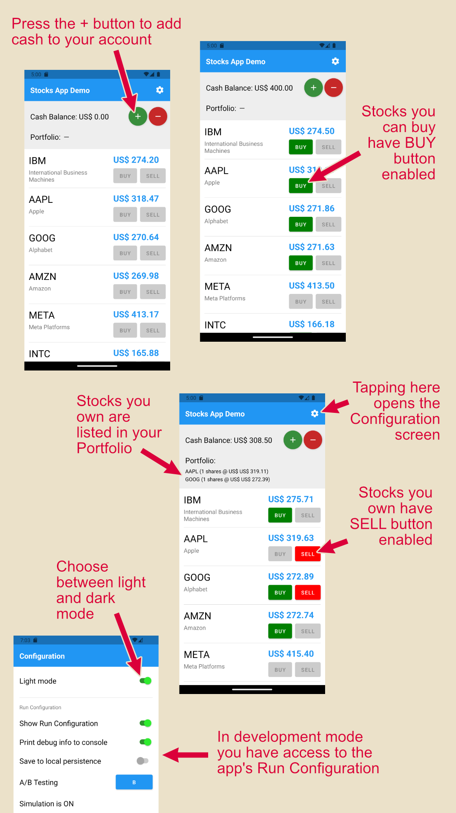

# Same App, Different Tech

This project contains the SAME MOBILE APP implemented with DIFFERENT TECH STACKS.

**React Native:**
* React Native with no third-party state management (hooks only)
* <a href='./MobileAppReactNativeMobX/README.md'>React Native with MobX</a>
* <a href='./MobileAppReactNativeKeystone/README.md'>React Native with MobX Keystone</a>
* React Native with Redux Toolkit

**Flutter:**
* Flutter with no third-party state management
* Flutter with Bloc
* Flutter with Provider
* Flutter with MobX
* Flutter with Redux

**Native:**
* Android Jetpack
* iOS SwiftUI

## Helps you learn

If you're already familiar with one of these technologies and you want to learn another,
you may open both side by side and compare them.

## Helps you decide which to use

It provides you with a consistent reference point to compare the implementation of functionally identical
applications. If you and your team are trying to decide which technology to use for your next project, you can
compare the different implementations and decide which one you like best.

## Helps you start

Once you decide, you can clone the chosen repository to use as a clean code and well-organized starting point for your
own app.

## What is the app like?

The app is simple, but not trivial. 
Its size was chosen so that it contains enough to achieve the above-stated goals, without being overly complex. 

The app allows you to add money to your account, and then buy and sell stocks. 
It shows you the portfolio of stocks you currently own.
The app also includes a configuration screen to choose between light and dark modes.

Below is a visual explanation of the app's interface:

## The apps demonstrate the following:

* Mobile framework (React Native, Flutter or Native) and State Management.

* Easy theming, and changing between light and dark modes.

* Easy styling of your components.

* Uncoupling the backend communication by using a DAO (Data Access Object) pattern:
    * Using a "fake" backend for development and testing
    * Using a "real" backend for production
    * Both on-demand fetching (REST get) and continuous streaming (WebSocket)

* Saving data to local storage.

* Configuring the app with a "Run Configuration".

* Creating a "playground" to help develop components in isolation.

* Guidelines for organizing app directories.

* How to test the app.

* Clean code principles: Simple and easy to understand. Easy to develop, refactor, change, maintain and test.

To keep it simple, it does not include features like navigation, authentication, and internationalization.

